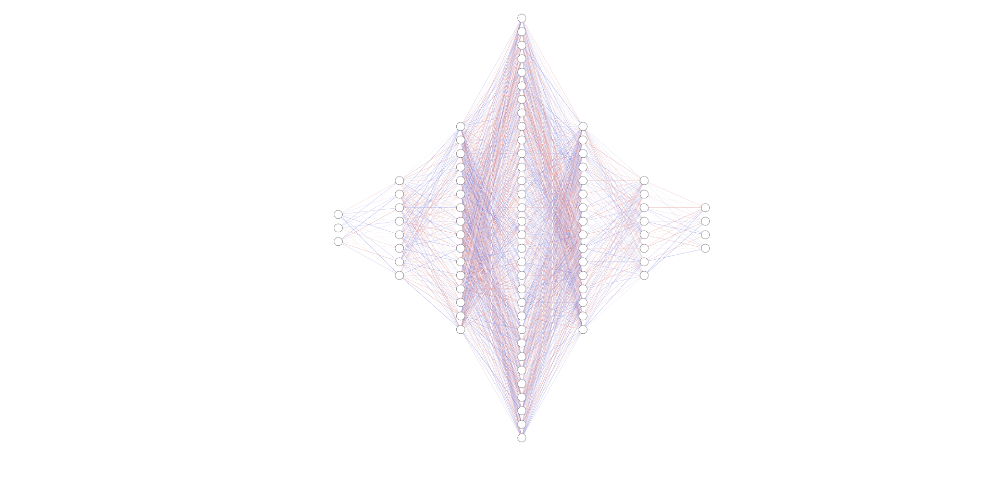

Matisse BABONNEAU

# BrickBreaker (AI) - Neural Network + Genetic Algorithm

> The objective of this project is to learn artificial intelligence programming. It is therefore a project of discovery and theoretical approach of the subject. All the solutions presented here are the result of personal choices and do not necessarily correspond to the most efficient choices. 

## Contents

* [Neural Network](#neural-network)
* [Genetic Algorithm](#genetic-algorithm)

# Neural Network

The first phase of the project is the creation of a neural network. Indeed, the final objective is to combine a NN and a genetic algorithm. 

The neural network was therefore developed according to the following model.

| Layer      | Flatten (input) | Dense | Dense | Dense | Dense | Dense | Dense (output) |
|------------|-----------------|-------|-------|-------|-------|-------|----------------|
| Size       | 3               | 128   | 256   | 512   | 256   | 128   | 4              |
| Activation | None            | ReLu  | ReLu  | ReLu  | ReLu  | ReLu  | SoftMax        |

The model once trained can be able to play. However, the aim is to use a genetic algorithm to improve the weights and biases of the neural network.

# Genetic Algorithm

