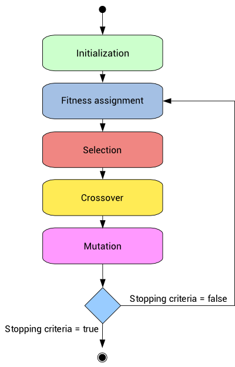

Matisse BABONNEAU

# BrickBreaker (AI) - Neural Network + Genetic Algorithm


> The objective of this project is to learn artificial intelligence programming with genetic algorithm. It is therefore a project of discovery and theoretical approach of the subject. All the solutions presented here are the result of personal choices and do not necessarily correspond to the most efficient choices. 


## Contents

* [Train a neural network](#train-a-neural-network)
* [Optimization of the neural network using a genetic algorithm](#optimization-of-the-neural-network-using-a-genetic-algorithm)
* [Results of the optimization](#results-of-the-optimization)

# Train a neural network

The first phase of the project is the creation of a neural network. Indeed, the final objective is to combine a NN and a genetic algorithm. 

The neural network was therefore developed according to the following model.


| Layer      | Flatten (input) | Dense | Dense | Dense | Dense | Dense | Dense (output) |
|------------|-----------------|-------|-------|-------|-------|-------|----------------|
| Size       | 3               | 128   | 256   | 512   | 256   | 128   | 4              |
| Activation | None            | ReLu  | ReLu  | ReLu  | ReLu  | ReLu  | SoftMax        |

Tensorflow NN Code:

```python
self.model = tf.keras.Sequential([
    tf.keras.layers.Flatten(input_shape=(3,)),
    tf.keras.layers.Dense(128, activation='relu'),
    tf.keras.layers.Dense(256, activation='relu'),
    tf.keras.layers.Dense(512, activation='relu'),
    tf.keras.layers.Dense(256, activation='relu'),
    tf.keras.layers.Dense(128, activation='relu'),
    tf.keras.layers.Dense(4, activation='softmax')
])
self.model.compile(optimizer='adam', loss=tf.keras.losses.categorical_crossentropy, metrics=['accuracy'])
```

Note that this neural network is a Q-Network. It could be used in a DQN with a Q-learning algorithm. However it is not the method used here. [Tensorflow DQN article.](https://www.tensorflow.org/agents/tutorials/0_intro_rl)

```
_________________________________________________________________
Layer (type)                 Output Shape              Param #   
=================================================================
flatten (Flatten)            (None, 3)                 0         
_________________________________________________________________
dense (Dense)                (None, 128)               512       
_________________________________________________________________
dense_1 (Dense)              (None, 256)               33024     
_________________________________________________________________
dense_2 (Dense)              (None, 512)               131584    
_________________________________________________________________
dense_3 (Dense)              (None, 256)               131328    
_________________________________________________________________
dense_4 (Dense)              (None, 128)               32896     
_________________________________________________________________
dense_5 (Dense)              (None, 4)                 516       
=================================================================
Total params: 329,860
Trainable params: 329,860
Non-trainable params: 0
_________________________________________________________________
```

The model can be trained using a simple reinforcement learning strategy, notably by observing the scores produced during training. The model once trained can be able to play. However, the aim is to use a genetic algorithm to improve the weights and biases of the neural network.

# Optimization of the neural network using a genetic algorithm

Neural Networks coupled with Genetic Algorithms can really accelerate the learning process to solve a certain problem. 

One of the most important points of this form of learning is that NN requires a huge amount of data for its learning, whereas GA can perform with less data.

The genetic algorithm thus makes it possible to optimise the performance of a neural network.

The main objective is to implement a life cycle and reproduction generation based on biology: 

> __Selection__:
>
> To determine which individuals are more likely to perform best, a selection is made.
This process is analogous to a natural selection process, with the most adapted individuals winning the reproductive competition while the least adapted die before reproduction, thus improving overall adaptation.
>
>  __Crossover__: 
>
> During this operation, two chromosomes exchange parts of their chains, to give new chromosomes. These crossings can be simple or multiple.
>
> __Mutations__:
>
> In a random way, a gene can mutate within a chromosome.
 


Preparation of the algorithm

* Create a population of several NNs.
* Assign random hyper-parameters (weights and bias) to all the NNs.

Algorithm (for each generation and a candidates population):

1. Play all the NNs simultaneously or one by one.

2. Calculate the performance of each NN based on its cost. Fitness will be used to increase the chances of a NN “reproducing.” 

3. Choose the 2 best NNs. For the 2 next ones you have to crossover genes (weights and bias). 

4. Select some childs to repopulate the next generation.

5. Mutate the genes of the childs. Mutating is required to maintain some amount of randomness in the GA.

```python
def natural_selection(population, path, env, generations, games, ram_obs, mutate_man, mutate_prob, crossover_prob):
    # GENERATE INITIAL POPULATION (ADD SOME VARIATIONS)
    models = []
    for _ in range(population):
        model = nn.NeuralNetwork()
        model.load(path)
        model.genetic_weights_admixture(GeneticAdmixture.MUTATION, mutate_prob, magnitude = mutate_man)
        models.append(model)
    # FOR EACH GENERATION
    for generation in range(generations):
        # PLAY
        best_score = 0
        models_scores_mean = []
        for model in range(population):
            models_scores_mean.append(player.play(models[model], env, games, ram_obs, False, False, True))
            print(f"* Generation: {generation}, Model: {model}, Score: {models_scores_mean[-1]}")
        best_score = max(models_scores_mean)
        # NEW POPULATION
        new_models = []
        # SELECT THE 2 BEST
        for _ in range(2):
            best = np.argmax(models_scores_mean)
            models_scores_mean[best] = 0
            new_models.append(models[best])
        # CROSSOVER BETWEEN THE 2 BEST FOR THE FOLLOWING 2
        for two_next in range(2):
            other = np.argmax(models_scores_mean)
            models_scores_mean[other] = 0
            model = models[other]
            model.copy_dna_weights(new_models[two_next].model)
            model.genetic_weights_admixture(GeneticAdmixture.CROSSOVER, crossover_prob, model = new_models[1 if two_next == 0 else 0].model)
            new_models.append(model)
        # REPRODUCE BEST
        for _ in range(2):
            new_models.append(new_models[0])
        # SAVE BEST MODEL
        new_path = path+"_"+"darwin"+"_"+str(generation)+"_"+str(best_score)
        print(f"--> Save model: {new_path}")
        new_models[0].save(new_path)
        # MUTATE POPULATION
        for candidate in range(2,len(new_models)):
            new_models[candidate].genetic_weights_admixture(GeneticAdmixture.MUTATION, mutate_prob, magnitude=mutate_man)
        # SAVE NEW POPULATION
        models = new_models
```

# Results of the optimization


